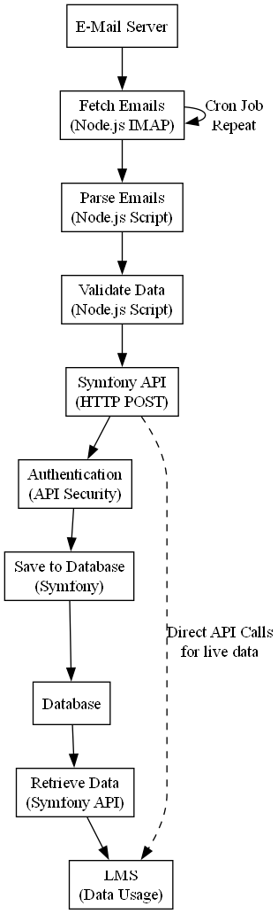

## Automatisierung der Lead-Verarbeitung
Um die Aufgabe zur Entwicklung eines Konzepts für die automatisierte Überführung von Leads in ein Learning Management System (LMS) basierend auf Symfony detaillierter zu erläutern, werde ich die notwendigen Schritte zur Implementierung einer API oder eines Skripts aufschlüsseln. Das Ziel ist es, die Leads, die per E-Mail von Plattformen wie FernstudiumCheck eingehen, effizient und sicher in das LMS zu übertragen.

### 1. **Analyse der Lead-Quellen**

#### **Identifikation der Quellen**
- **Ziel**: Bestimmen, welche Plattformen Leads per E-Mail senden, und wie diese Leads strukturiert sind.
- **Schritte**:
  - Liste der Plattformen erstellen (z.B. FernstudiumCheck, andere Partnerplattformen).
  - Beispielhafte Lead-E-Mails analysieren, um das Format und den Inhalt zu verstehen.
  - Prüfen, ob die Daten strukturiert (z.B. JSON, XML) oder unstrukturiert (Plain Text) vorliegen.

#### **Analyse der Datenstruktur**
- **Ziel**: Sicherstellen, dass alle notwendigen Informationen (z.B. Name, E-Mail, Studiengang) in einem strukturierten und verarbeitbaren Format vorliegen.
- **Schritte**:
  - Extraktion der relevanten Felder aus den Lead-Daten.
  - Mapping der Felder auf die Datenstruktur im LMS.

### 2. **Entwicklung eines Node.js-Skripts zur E-Mail-Verarbeitung**

#### **Sichere E-Mail-Integration**
- **Ziel**: Automatisiertes Abrufen und Verarbeiten von Lead-E-Mails.
- **Schritte**:
  - Implementierung eines Node.js-Skripts, das die IMAP-Bibliothek nutzt, um E-Mails vom Mail-Server sicher abzurufen.
  - Verwenden von SSL/TLS für eine sichere Verbindung.
  - Einbindung von `imap-simple` zur Vereinfachung des Abrufs und der Verarbeitung von E-Mails.

#### **Parsing und Datenextraktion**
- **Ziel**: Präzise Extraktion der Lead-Informationen aus den E-Mails.
- **Schritte**:
  - Entwicklung eines Parsers im Node.js-Skript, der die spezifischen Informationen (z.B. Name, E-Mail, Telefonnummer) aus dem E-Mail-Text oder Anhang extrahiert.
  - Behandlung verschiedener E-Mail-Formate (z.B. HTML, Plain Text).

### 3. **Entwicklung der Symfony-API**

#### **Design und Implementierung einer RESTful API**
- **Ziel**: Bereitstellung einer Schnittstelle, über die das Node.js-Skript die extrahierten Lead-Daten in das LMS überträgt.
- **Schritte**:
  - Erstellung einer neuen Symfony-Komponente zur Verarbeitung von Lead-Daten.
  - Definieren von API-Endpunkten wie `/api/leads`, die HTTP-POST-Anfragen verarbeiten können.
  - Datenvalidierung im API-Controller, um sicherzustellen, dass die Daten korrekt und vollständig sind.

#### **Datenmodellierung und Speicherung**
- **Ziel**: Strukturierte Speicherung der Lead-Daten im LMS.
- **Schritte**:
  - Entwicklung der notwendigen Datenbank-Modelle in Symfony, um die Leads effizient zu speichern.
  - Erstellung von Migrationsskripten, um die erforderlichen Tabellen und Beziehungen in der Datenbank zu definieren.

#### **Sicherheitsaspekte**
- **Ziel**: Schutz der API vor unbefugtem Zugriff und Sicherstellung der Datenintegrität.
- **Schritte**:
  - Implementierung von Authentifizierungsmethoden wie OAuth 2.0 oder JWT (JSON Web Tokens).
  - Sicherstellung, dass alle API-Endpunkte nur über HTTPS aufgerufen werden können.
  - Hinzufügen von Sicherheitsheadern und Schutz vor gängigen Sicherheitslücken (z.B. SQL-Injection, CSRF).

### 4. **Automatisierung und Monitoring**

#### **Automatisierung durch Cron-Jobs**
- **Ziel**: Regelmäßiges Abrufen und Verarbeiten der E-Mails.
- **Schritte**:
  - Konfiguration von Cron-Jobs, um das Node.js-Skript regelmäßig (z.B. alle 5 Minuten) auszuführen.
  - Sicherstellung, dass der Prozess auch bei Systemneustarts automatisch wieder gestartet wird.

#### **Logging und Monitoring**
- **Ziel**: Überwachung des gesamten Prozesses, um Fehler frühzeitig zu erkennen und zu beheben.
- **Schritte**:
  - Implementierung von Logging mit Winston, um alle Schritte des E-Mail-Abrufs und der Datenverarbeitung zu protokollieren.
  - Nutzung von PM2 für das Monitoring der Node.js-Anwendung, um sicherzustellen, dass sie stabil und performant läuft.

### 5. **Testing und Qualitätssicherung**

#### **Teststrategie**
- **Ziel**: Sicherstellen, dass die Lösung fehlerfrei funktioniert.
- **Schritte**:
  - Schreiben von Unit-Tests für das Node.js-Skript, um die korrekte Extraktion und Verarbeitung der E-Mails zu prüfen.
  - Integrationstests für die Symfony-API, um die Datenübergabe und Speicherung zu validieren.
  - Durchführung von Lasttests, um die Skalierbarkeit und Performance der API zu überprüfen.

#### **Testumgebung**
- **Ziel**: Sichere und kontrollierte Umgebung für die Tests.
- **Schritte**:
  - Aufsetzen einer dedizierten Testumgebung, die eine exakte Kopie der Produktionsumgebung darstellt.
  - Nutzung von Testdaten, um die Funktionalität der gesamten Pipeline zu simulieren und zu überprüfen.

### 6. **Deployment und Betrieb**

#### **API-Deployment**
- **Ziel**: Sicherer und stabiler Betrieb der API in der Produktionsumgebung.
- **Schritte**:
  - Bereitstellung der Symfony-API auf einem gesicherten Produktionsserver.
  - Implementierung von Maßnahmen wie regelmäßige Sicherheitsupdates und Backup-Strategien.

#### **Node.js-Skript Deployment**
- **Ziel**: Verlässliche Ausführung des Skripts im Produktivbetrieb.
- **Schritte**:
  - Deployment des Node.js-Skripts zusammen mit der Konfiguration der Cron-Jobs.
  - Sicherstellen, dass das Skript robust gegen Netzwerk- oder Serverausfälle ist.

### 7. **Dokumentation und Zusammenarbeit**

#### **Technische Dokumentation**
- **Ziel**: Klarheit und Transparenz für Entwickler und Administratoren.
- **Schritte**:
  - Erstellung einer detaillierten Dokumentation für die API-Endpunkte, die Datenstrukturen und die Konfiguration des Node.js-Skripts.
  - Beschreibung der Installations- und Update-Prozesse für das System.

#### **Zusammenarbeit mit externen Entwicklern**
- **Ziel**: Sicherstellen, dass alle Beteiligten nach den besten Praktiken arbeiten.
- **Schritte**:
  - Einrichtung eines Versionskontrollsystems (z.B. Git) zur koordinierten Entwicklung und Code-Reviews.
  - Regelmäßige Abstimmungen und Code-Reviews mit externen Entwicklern, um die Einhaltung der Entwicklungsstandards sicherzustellen.

**Visualisierung**
Um das detaillierte Konzept für die automatisierte Überführung von Leads in ein Learning Management System (LMS) zu illustrieren, habe ich ein umfassendes Diagramm erstellt, das den Workflow visualisiert. Dieses Diagramm zeigt die verschiedenen Schritte, von der initialen E-Mail-Abfrage bis hin zur Datenintegration in das LMS. Es hilft, die Komplexität des Systems zu verstehen und stellt sicher, dass jeder Schritt klar definiert ist.

Das Diagramm bietet einen visuellen Überblick über die Schlüsselkomponenten und Prozesse, einschließlich:

- **E-Mail-Server**: Der Startpunkt, wo Leads gesammelt werden.
- **Node.js-Skript**: Verantwortlich für das Abrufen und Parsen der E-Mails.
- **Symfony API**: Hier werden die extrahierten Daten validiert und in die Datenbank eingespeist.
- **Datenbank**: Speichert alle relevanten Lead-Informationen.
- **LMS**: Das Endsystem, das die Daten für Bildungszwecke nutzt.

Jeder Pfeil im Diagramm symbolisiert den Datenfluss zwischen den Komponenten, was die Zusammenhänge und Abhängigkeiten innerhalb des Systems verdeutlicht. Dies unterstützt die Implementierung und ermöglicht es, spezifische Prozesse zu optimieren und zu sichern.