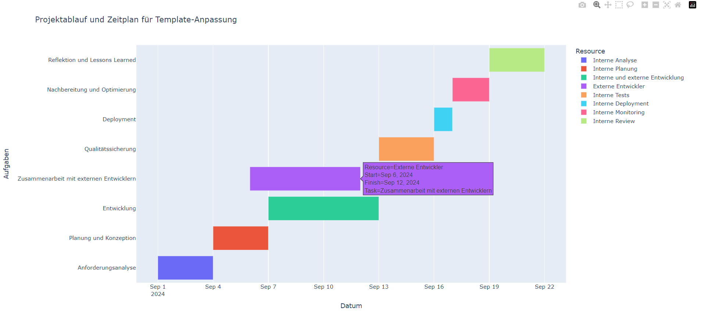

## Entwicklung und Anpassung von Templates im Contao CMS

### 1. **Anforderungsanalyse**

   - **Detaillierte Analyse des Benutzerfeedbacks**: Zunächst wird das erhaltene Feedback gründlich analysiert, um die genauen Anforderungen und Zielsetzungen der neuen Funktionalität zu verstehen. Zum Beispiel könnte das Feedback beinhalten, dass die Nutzer eine bessere mobile Navigation wünschen oder dass bestimmte Inhalte prominenter dargestellt werden sollen. Ziel ist es, den Nutzen für die Benutzer klar zu identifizieren und sicherzustellen, dass die Anpassungen optimal auf deren Bedürfnisse eingehen.
   - **Bewertung der bestehenden Template-Architektur**: Im Anschluss erfolgt eine Untersuchung der aktuellen Contao-Template-Struktur, insbesondere der `.tpl`-Dateien und des zugrunde liegenden HTML/CSS-Codes, um die relevanten Bereiche für die Implementierung zu identifizieren. Dabei werden mögliche Konflikte mit bestehenden Erweiterungen oder Anpassungen frühzeitig erkannt, um eine reibungslose Integration zu gewährleisten.

### 2. **Planung und Konzeption**

   - **Erstellung eines technischen Konzepts**: Basierend auf der Anforderungsanalyse wird ein technisches Konzept entwickelt, das alle notwendigen Änderungen und Anpassungen im Frontend und Backend spezifiziert. Beispielsweise wird geprüft, ob vorhandene Contao-Erweiterungen (z.B. News-Module, Event-Module) angepasst oder ob neue Contao-Erweiterungen entwickelt werden müssen, um die gewünschte Funktionalität zu realisieren.
   - **Aufwandsschätzung und Timeline**: Auf Grundlage des technischen Konzepts wird eine Aufwandsschätzung erstellt und ein detaillierter Projektplan mit klar definierten Meilensteinen und Deadlines erarbeitet. Ein Beispiel-Milestone könnte die Integration einer neuen Suchfunktion bis zum Ende der zweiten Projektwoche sein.

### 3. **Entwicklung**

   - **Branching und Versionskontrolle**: Für die Entwicklung wird ein separater Feature-Branch im Git-Repository erstellt, der nach dem Git-Flow-Modell organisiert ist. Dies gewährleistet, dass die Stabilität des Hauptzweigs erhalten bleibt, während die neuen Funktionen entwickelt werden. Zum Beispiel:
     ```bash
     git checkout -b feature/contao-template-update
     ```
   - **Umsetzung der Anpassungen**: Die Anpassungen werden gemäß des technischen Konzepts durchgeführt. Dies kann die Anpassung von Contao-Template-Dateien (`.tpl`-Dateien), Änderungen an den Modulkonfigurationen oder die Entwicklung neuer Frontend-Module umfassen. Hier ist ein Beispiel für eine Anpassung in einer `.tpl`-Datei:
     ```html
     <div class="navigation">
       <!-- Neue Navigationsstruktur basierend auf Benutzerfeedback -->
       <ul>
         <li><a href="{{link_url}}">Home</a></li>
         <li><a href="{{link_url}}/about">About</a></li>
         <li><a href="{{link_url}}/contact">Contact</a></li>
       </ul>
     </div>
     ```
     Dabei werden Contao-spezifische Funktionen und Markup verwendet, um sicherzustellen, dass das Template kompatibel bleibt und die Performance optimiert wird.

### 4. **Zusammenarbeit mit externen Entwicklern**

Eine effektive Zusammenarbeit mit externen Entwicklern ist entscheidend, um sicherzustellen, dass das Template nach den besten Praktiken entwickelt wird. Hier sind die spezifischen Schritte und Strategien, die umgesetzt werden:

1. **Klare Definition von Rollen und Verantwortlichkeiten**
   - **Rollenzuweisung**: Jeder Entwickler, ob intern oder extern, erhält eine klar definierte Rolle. Zum Beispiel könnte ein externer Entwickler die Verantwortung für die Anpassung eines spezifischen Frontend-Moduls übernehmen.
   - **Verantwortlichkeiten**: Besonders kritische Aufgaben wie die Integration von Drittanbieter-Extensions oder die Anpassung von Backend-Modulen werden spezifischen Entwicklern zugewiesen und umfassend dokumentiert.

2. **Etablierung effektiver Kommunikationswege**
   - **Kommunikationstools**: Tools wie Slack, Microsoft Teams oder Zoom werden für regelmäßige Check-Ins genutzt. Diese ermöglichen es, Fragen schnell zu klären und den Projektfortschritt transparent zu halten. Wöchentliche Video-Calls sorgen für den Abgleich und die Klärung offener Fragen.
   - **Regelmäßige Meetings**: Durch regelmäßige Sync-Meetings wird der Fortschritt überprüft, Hindernisse identifiziert und Lösungsansätze werden gemeinsam diskutiert. Dies ist besonders wichtig, wenn externe Entwickler in verschiedenen Zeitzonen arbeiten.

3. **Einführung eines strengen Code-Review-Prozesses**
   - **Peer Reviews**: Jeder Code wird von mindestens einem anderen Teammitglied geprüft, bevor er in den Hauptbranch überführt wird. Dies verbessert die Code-Qualität und minimiert Fehler. GitHub Pull Requests werden genutzt, um Reviews zu organisieren.
   - **Pair Programming**: Bei komplexen oder kritischen Aufgaben wird gezielt Pair Programming eingesetzt, um den Wissenstransfer zu fördern und Konsistenz im Code sicherzustellen.

4. **Verwendung gemeinsamer Entwicklungswerkzeuge und Standards**
   - **Entwicklungswerkzeuge**: Alle Entwickler haben Zugang zu denselben Tools und Ressourcen, um die Konsistenz und Kompatibilität des Codes sicherzustellen. Zum Beispiel könnten spezifische Contao-Erweiterungen zentral bereitgestellt werden.
   - **Coding Standards**: Einheitliche Coding Standards und Richtlinien (z.B. PSR-12 für PHP) werden festgelegt, um die Lesbarkeit und Wartbarkeit des Codes zu verbessern.

### 5. **Versionskontrolle und Qualitätssicherung**

Eine ordnungsgemäße Versionskontrolle und Qualitätssicherung sind entscheidend für den Projekterfolg. Hier sind die Hauptstrategien, die verfolgt werden:

1. **Strategische Branching-Modelle**
   - **Git-Flow**: Das Git-Flow-Modell wird genutzt, das spezifische Branches für Features, Releases und Hotfixes vorsieht. Dies ermöglicht es, Entwicklungen strukturiert und isoliert zu halten, was die Übersicht und Stabilität des Codes verbessert.
   - **Feature-Branches**: Jede neue Funktionalität wird in einem eigenen Branch entwickelt, getestet und erst nach erfolgreicher Review in den Hauptbranch (master) gemerged.

2. **Automatisierte Testverfahren**
   - **Unit-Tests**: Unit-Tests werden für jede neue Funktion oder Komponente implementiert, um sicherzustellen, dass der Code wie vorgesehen funktioniert. PHPUnit wird für die Implementierung und Ausführung der Tests genutzt.
   - **Integrationstests**: Integrationstests werden durchgeführt, um die Interaktion zwischen verschiedenen Teilen des Contao-Templates zu überprüfen. Diese Tests werden als Teil der CI-Pipeline ausgeführt.
   - **Continuous Integration (CI)**: Eine CI-Pipeline wird eingerichtet, die automatisierte Builds und Tests durchführt, sobald Änderungen vorgenommen werden. Dies hilft, Fehler frühzeitig zu erkennen und die Qualität des Codes kontinuierlich zu überwachen.
   **Ein Beispiel für eine CI-Konfiguration in GitLab:**

   ```yaml
   stages:
     - build
     - test
     - deploy

   build_job:
     stage: build
     script:
       - npm install
       - npm run build

   test_job:
     stage: test
     script:
       - phpunit --configuration phpunit.xml

   deploy_job:
     stage: deploy
     script:
       - ./deploy.sh
   ```


3. **Dokumentation und Reporting**
   - **Dokumentation**: Jede Codeänderung, Entscheidung und Architektur wird sorgfältig dokumentiert, um zukünftige Wartungsarbeiten zu erleichtern. Confluence oder das GitHub-Wiki können hierfür genutzt werden.
   - **Fehlertracking und -management**: Tools wie Jira oder Bugzilla werden genutzt, um Fehler zu verfolgen und zu verwalten, um sicherzustellen, dass alle Probleme effektiv adressiert und gelöst werden.

4. **Staging und Abnahme**
   - **Staging-Umgebung**: Eine Staging-Umgebung wird eingerichtet, die der Produktionsumgebung so nah wie möglich kommt. Dadurch kann das Template umfassend unter realen Bedingungen getestet werden.
   - **Stakeholder-Feedback**: Feedback von Stakeholdern wird in der Staging-Phase eingeholt, um sicherzustellen, dass alle Anforderungen erfüllt sind, bevor das Template live geht.

### 6. **Deployment**

   - **Vorbereitung des Deployments**: Vor dem Livegang wird ein vollständiges Backup der aktuellen Live-Umgebung erstellt und ein Rollback-Plan vorbereitet, um bei Problemen schnell reagieren zu können.
   - **Durchführung des Deployments**: Das Deployment erfolgt in einem abgestimmten Zeitfenster, um den laufenden Betrieb möglichst wenig zu stören. Nach dem Deployment wird die Website intensiv überwacht, z.B. durch Einsatz von Monitoring-Tools wie New Relic, um die Performance und Stabilität sicherzustellen.

### 7. **Nachbereitung und Optimierung**

   - **Monitoring und Feedback-Loop**: Nach dem Deployment wird die neue Funktionalität kontinuierlich überwacht. Hierbei kommen Monitoring-Tools wie New Relic oder Grafana zum Einsatz, um die Performance, Sicherheit und Stabilität der Anwendung zu überwachen. Zusätzlich wird Benutzerfeedback über Tools wie Hotjar oder direkte Umfragen gesammelt, um die tatsächliche Benutzererfahrung zu bewerten.
   - **Iterative Verbesserungen**: Basierend auf den gesammelten Daten und dem Benutzerfeedback werden iterative Verbesserungen vorgenommen. Dieser Zyklus ermöglicht es, das Template kontinuierlich zu optimieren und auf sich ändernde Anforderungen und Benutzererwartungen einzugehen.
   - **Dokumentation und Wissensaustausch**: Alle durchgeführten Änderungen und Optimierungen werden detailliert dokumentiert, um zukünftige Anpassungen zu erleichtern. Erkenntnisse und Best Practices aus dem Projekt werden intern geteilt, um das Wissen im Team zu verbreiten und kontinuierliche Verbesserungen zu fördern.

### 8. **Reflektion und Lessons Learned**

   - **Projekt-Review**: Nach Abschluss des Projekts wird eine Retrospektive durchgeführt, um technische und organisatorische Aspekte zu analysieren. In dieser Phase werden sowohl positive als auch negative Erfahrungen besprochen, um daraus für zukünftige Projekte zu lernen. Tools wie Miro oder ein einfaches Whiteboard können verwendet werden, um Gedanken und Vorschläge zu sammeln.
   - **Identifikation von Verbesserungspotenzialen**: Basierend auf den Erkenntnissen aus der Retrospektive werden konkrete Maßnahmen abgeleitet, um zukünftige Projekte effizienter und erfolgreicher zu gestalten. Beispielsweise könnten Entscheidungen bezüglich der verwendeten Technologien oder Arbeitsabläufe überdacht und angepasst werden.
   - **Dokumentation von Lessons Learned**: Die wichtigsten Erkenntnisse und Verbesserungsvorschläge werden dokumentiert und im Projektmanagement-Tool oder Wiki festgehalten, um sicherzustellen, dass diese in zukünftigen Projekten berücksichtigt werden. Dies kann auch die Erstellung von Leitfäden für ähnliche Projekte beinhalten, die auf den gewonnenen Erfahrungen basieren.

## Beispiel Planung

- **Bild**:  
  

## Live Interaktion mit der Planung

- **Link**:  
  [Live Interaktion öffnen](./Entwicklung-und-Anpassung-von-Templates-Plan.html)

