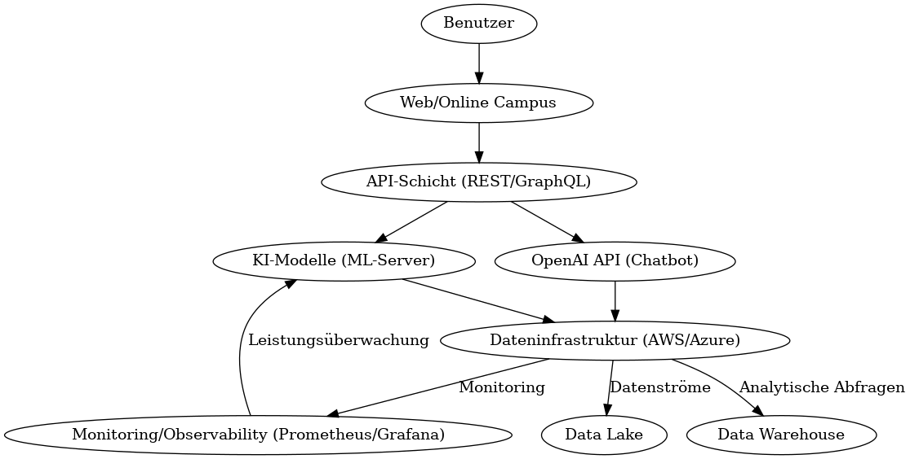
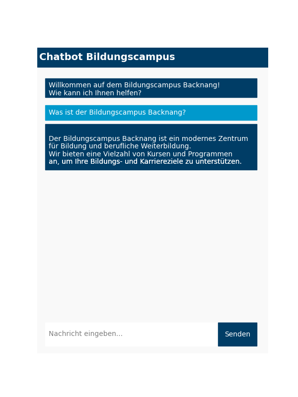
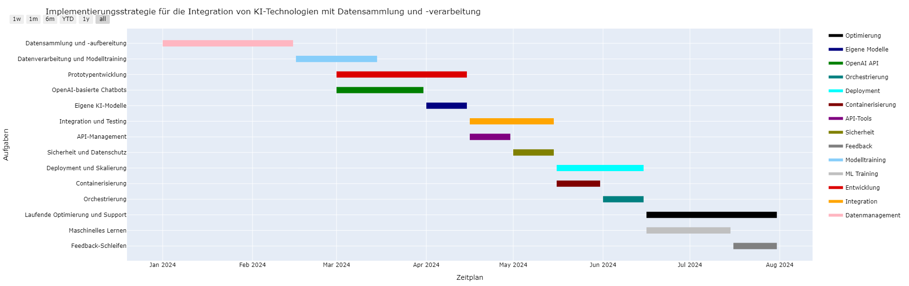

## Das Konzept: Integration von OpenAI-APIs und maßgeschneiderten Machine Learning Modellen

Dieses Konzept nutzt die Leistungsfähigkeit von OpenAI-APIs in Kombination mit speziell entwickelten Machine Learning Modellen, um eine herausragende Benutzererfahrung zu bieten und betriebliche Prozesse effizient zu gestalten.

### Funktionelle Einsatzbereiche

1. **Personalisierte Lernpfade:**
   - **Funktion:** Entwicklung eines adaptiven Lernsystems, das auf Grundlage von Nutzerinteraktionen und Lernfortschritten individualisierte Lernpfade erstellt. Diese Pfade passen sich dynamisch den Bedürfnissen und Lernstilen der Studierenden an und fördern somit ein effektiveres Lernen.
   - **Ziele:** Steigerung der Lerneffizienz und Verbesserung der Lernergebnisse durch gezielte Anpassung von Lehrmaterialien und Methoden, die auf die individuellen Bedürfnisse der Studierenden zugeschnitten sind.
   - **Erweiterung:** Die Lernpfade könnten durch den Einsatz von Reinforcement Learning weiter optimiert werden, wobei das System durch kontinuierliches Feedback von Studierenden lernt, welche Materialien und Methoden am effektivsten sind.

2. **Chatbots für den Kundensupport:**
   - **Funktion:** Implementierung von Chatbots auf Basis von OpenAI's GPT-3, um häufig gestellte Fragen zu beantworten und die Navigation im Online-Campus zu unterstützen. Diese Bots nutzen Natural Language Processing (NLP), um natürliche Sprache zu verstehen und benutzerfreundliche Antworten zu generieren.
   - **Ziele:** Verbesserung der Erreichbarkeit und Reaktionsfähigkeit des Supports sowie Entlastung des menschlichen Support-Teams durch automatisierte Antworten, die dennoch eine hohe Qualität und Genauigkeit bieten.
   - **Erweiterung:** Integration eines Eskalationspfads, bei dem komplexe Anfragen automatisch an menschliche Support-Mitarbeiter weitergeleitet werden, wenn der Chatbot eine Frage nicht zufriedenstellend beantworten kann.

3. **Automatische Inhaltsanpassungen:**
   - **Funktion:** Einsatz von Machine Learning, um Inhalte auf der Website und im Online-Campus dynamisch an das Benutzerverhalten und -feedback anzupassen. Dadurch wird sichergestellt, dass den Nutzern stets die relevantesten Informationen und Materialien präsentiert werden.
   - **Ziele:** Erhöhung des Benutzerengagements und der Zufriedenheit durch personalisierte und relevante Inhalte, die den spezifischen Bedürfnissen der Nutzer entsprechen.
   - **Erweiterung:** Entwicklung eines A/B-Testing-Systems, das verschiedene Inhaltsversionen testet und die am besten performenden Inhalte automatisch auswählt und präsentiert.

4. **Automatisierte Inhaltsgenerierung:**
   - **Funktion:** Nutzung von gpt-4o-mini zur automatischen Erstellung und Aktualisierung von Inhalten, wie Blogbeiträgen, Kursbeschreibungen oder FAQs. Diese Inhalte können auf aktuellen Trends und Benutzeranfragen basieren.
   - **Ziele:** Sicherstellung, dass die Website und der Online-Campus stets aktuelle und relevante Inhalte bieten, ohne dass manuelle Eingriffe erforderlich sind.

5. **Vorhersage von Abbruchquoten:**
   - **Funktion:** Implementierung von Machine Learning Modellen, die die Wahrscheinlichkeit eines Studienabbruchs basierend auf Verhaltensdaten und Engagement-Metriken vorhersagen.
   - **Ziele:** Proaktives Eingreifen durch Mentoring oder zusätzliche Ressourcen, um die Abbruchquoten zu senken und die Studienerfolge zu erhöhen.

### Vorgeschlagene Technologien und Frameworks

1. **OpenAI API:**
   - **Einsatzgebiet:** Verwendung der OpenAI API für den Betrieb von Chatbots und automatisierten Antwortsystemen. Die fortschrittlichen NLP-Modelle von OpenAI bieten eine herausragende Qualität und Genauigkeit bei der Verarbeitung natürlicher Sprache.
   - **Vorteile:** Reduzierung der Entwicklungszeit durch den Einsatz vortrainierter Modelle, die kontinuierlich aktualisiert und verbessert werden. Zusätzlich ermöglicht die API eine flexible Integration in bestehende Systeme.

2. **Eigene Machine Learning Modelle:**
   - **Einsatzgebiet:** Entwicklung spezifischer ML-Modelle für personalisierte Lernpfade und dynamische Inhaltsanpassungen. Diese Modelle werden mit TensorFlow oder PyTorch entwickelt und an die spezifischen Anforderungen und Daten des Bildungscampus angepasst.
   - **Vorteile:** Volle Kontrolle über die Modellparameter und die Möglichkeit, spezifische Features zu integrieren, die optimal auf die Bedürfnisse der Nutzer zugeschnitten sind. Dies erlaubt auch eine bessere Anpassung an die Datenschutzanforderungen.

3. **Webhooks und Echtzeit-API-Integration:**
   - **Einsatzgebiet:** Verwendung von Webhooks und Echtzeit-APIs, um sofortige Benachrichtigungen und Aktualisierungen im System zu ermöglichen, wie z.B. das automatische Auslösen von E-Mails oder Push-Benachrichtigungen basierend auf Benutzeraktionen.
   - **Vorteile:** Erhöhung der Reaktionsfähigkeit des Systems und Verbesserung der Benutzererfahrung durch Echtzeit-Interaktionen.

4. **Data Lakes und Data Warehouses:**
   - **Einsatzgebiet:** Implementierung von Data Lakes oder Data Warehouses zur Speicherung und Verwaltung großer Datenmengen, die für das Training der Machine Learning Modelle und die Echtzeitanalyse verwendet werden.
   - **Vorteile:** Ermöglicht die effiziente Speicherung, Verarbeitung und Analyse von Daten, was für die kontinuierliche Verbesserung der KI-Modelle unerlässlich ist.

5. **Monitoring und Observability Tools:**
   - **Einsatzgebiet:** Einsatz von Tools wie Prometheus und Grafana zur Überwachung der Systemleistung, der API-Nutzung und der ML-Modelle, um sicherzustellen, dass alles reibungslos funktioniert und Probleme frühzeitig erkannt werden.
   - **Vorteile:** Gewährleistung einer hohen Systemverfügbarkeit und Leistung, sowie eine schnellere Fehlerbehebung.

### Technische Anforderungen

- **Dateninfrastruktur:** Aufbau einer skalierbaren und sicheren Dateninfrastruktur unter Nutzung von Cloud-Diensten wie AWS oder Azure. Diese Plattformen bieten die notwendige Flexibilität und Skalierbarkeit, um große Datenmengen effizient zu verwalten und gleichzeitig höchste Sicherheitsstandards einzuhalten. Zusätzlich könnten Data Lakes für die Speicherung unstrukturierter Daten und Data Warehouses für strukturierte Daten implementiert werden.
- **KI- und ML-Frameworks:** Einsatz von TensorFlow und PyTorch für die Entwicklung von Machine Learning Modellen, ergänzt durch NLP-Bibliotheken wie spaCy für spezialisierte Textverarbeitungsaufgaben. Diese Frameworks bieten die Flexibilität, maßgeschneiderte Modelle für spezifische Anwendungsfälle zu erstellen.
- **API-Integration:** Entwicklung einer API-Schicht zur nahtlosen Integration der KI-Funktionen in die bestehenden Systeme, wobei RESTful-APIs oder GraphQL verwendet werden, um Kompatibilität und Erweiterbarkeit sicherzustellen. Echtzeit-APIs und Webhooks könnten verwendet werden, um sofortige Aktionen im System auszulösen.
- **Datenschutz und Sicherheit:** Strikte Einhaltung der GDPR-Richtlinien und Implementierung robuster Sicherheitsmaßnahmen, um den Schutz und die Integrität der Benutzerdaten zu gewährleisten. Dies umfasst auch die Verschlüsselung von Daten, sowohl im Ruhezustand als auch während der Übertragung, sowie regelmäßige Audits und Penetrationstests.

### Implementierungsstrategie

1. **Prototypentwicklung:**
   - **OpenAI-basierte Chatbots:** Entwicklung und Integration eines Prototyps für den Chatbot-Support unter Verwendung der OpenAI API. Dieser Prototyp wird in die bestehende Website und den Online-Campus integriert, um erste Benutzerinteraktionen zu testen und wertvolles Feedback zu sammeln. Dies könnte in einer kontrollierten Umgebung mit einer kleinen Gruppe von Benutzern geschehen, um Iterationen zu ermöglichen.
   - **Eigene KI-Modelle:** Entwicklung eines Prototyps für personalisierte Lernpfade, basierend auf historischen Nutzungsdaten. Diese Modelle werden kontinuierlich trainiert und optimiert, um den Lernfortschritt der Studierenden präzise vorhersagen und anpassen zu können. Ein A/B-Test könnte verwendet werden, um die Effektivität der personalisierten Lernpfade zu bewerten.

2. **Integration und Testing:**
   - **API-Management:** Nutzung von API-Management-Tools wie Kong oder Apigee, um eine effiziente und sichere Verbindung zwischen den OpenAI-basierten Services und den eigenen ML-Modellen zu gewährleisten. Dies umfasst auch das Monitoring der API-Performance und das Management von API-Schlüsseln.
   - **Sicherheit und Datenschutz:** Sicherstellung der Konformität mit Datenschutzbestimmungen durch Implementierung robuster Sicherheits- und Datenschutzpraktiken in der gesamten API-Infrastruktur. Ein Fokus sollte auf der Minimierung von Daten, der Einhaltung von „Privacy by Design“-Prinzipien und regelmäßigen Sicherheitsüberprüfungen liegen.

3. **Deployment und Skalierung:**
   - **Containerisierung:** Einsatz von Docker zur Containerisierung der ML-Modelle, was eine einfache Bereitstellung und Skalierung der Anwendungen ermöglicht. Dies erlaubt es, die Anwendungen in verschiedenen Umgebungen konsistent zu betreiben, sei es in der Entwicklung, im Test oder in der Produktion.
   - **Orchestrierung:** Nutzung von Kubernetes zur Orchestrierung der Container, um eine effiziente Ressourcennutzung und Verwaltung der Skalierungsanforderungen sicherzustellen. Kubernetes ermöglicht auch das automatische Scaling, das Load Balancing und die einfache Verwaltung von Updates.

4. **Laufende Optimierung und Support:**
   - **Maschinelles Lernen:** Regelmäßige Überprüfung und Anpassung der ML-Modelle basierend auf neuen Daten und Benutzerfeedback, um die Genauigkeit und Relevanz der Lernpfade und Inhaltsanpassungen kontinuierlich zu verbessern. Dies umfasst das Nachtrainieren der Modelle mit neuen Daten, die Identifizierung von Modellen, die unterperformen, und deren Optimierung oder Ersatz.
   - **Feedback-Schleifen:** Einrichtung von Feedback-Mechanismen, die kontinuierliches Lernen und die kontinuierliche Verbesserung der KI-Funktionen ermöglichen. Hierbei können Benutzer aktiv Feedback zu den Lernpfaden oder Chatbot-Antworten geben, das in die Weiterentwicklung der KI-Modelle einfließt.
   - **Monitoring und Wartung:** Implementierung eines umfassenden Monitorings für alle KI-Modelle und APIs, um Anomalien oder Leistungseinbrüche frühzeitig zu erkennen. Regelmäßige Wartung und Updates der KI-Modelle und Systeme gewährleisten eine hohe Verfügbarkeit und Leistung.
   - **Dokumentation und Wissensaustausch:** Detaillierte Dokumentation aller Entwicklungen, Erkenntnisse und Best Practices, um eine einfache Übergabe und Schulung für neue Teammitglieder zu ermöglichen. Interne Workshops und Wissensaustauschsitzungen helfen dabei, das Team kontinuierlich über den aktuellen Stand der Technologie und Implementierung auf dem Laufenden zu halten.

### Ethik und Datenschutz

1. **Vermeidung von Bias:** Bei der Entwicklung und dem Training der Machine Learning Modelle wird darauf geachtet, Bias zu vermeiden. Dies umfasst die Analyse der Trainingsdaten auf potenzielle Verzerrungen und die Implementierung von Techniken zur Reduktion von Bias, um faire und ausgewogene Ergebnisse zu gewährleisten.
2. **Transparenz:** Sicherstellung, dass die Entscheidungen der KI-Modelle nachvollziehbar und transparent sind. Dies könnte durch die Implementierung von Erklärungsmodellen (z.B. LIME oder SHAP) erreicht werden, die die Funktionsweise der KI verständlich machen.
3. **Datenschutz:** Strikte Einhaltung aller Datenschutzbestimmungen, einschließlich GDPR, und Sicherstellung, dass alle gesammelten Daten anonymisiert und nur für den vorgesehenen Zweck verwendet werden. Regelmäßige Datenschutz-Audits und Schulungen für das Team stellen sicher, dass die hohen Standards eingehalten werden.

### Beispielhafte Anwendungsfälle und Ergebnisse

1. **Fallstudien und Best Practices:** Präsentation von Fallstudien, in denen ähnliche KI-Lösungen erfolgreich implementiert wurden. Dies könnte die Implementierung von KI in Bildungseinrichtungen oder Unternehmen betreffen, die ähnliche Herausforderungen bewältigen mussten.
2. **Prognosen und KPIs:** Definition von klaren KPIs (Key Performance Indicators) zur Messung des Erfolgs der KI-Integration, wie z.B. eine Erhöhung der Abschlussquoten, eine Reduktion der Supportanfragen oder eine Steigerung des Benutzerengagements. Diese KPIs werden regelmäßig überprüft und optimiert.
3. **Success Stories:** Dokumentation von Erfolgsgeschichten, in denen die KI-Integration signifikante Verbesserungen gebracht hat, z.B. durch höhere Abschlussquoten, verbesserte Lernergebnisse oder gesteigerte Zufriedenheit der Studierenden.

### Visualisierung

1. **Architekturdiagramme:** 

2. **User Interface Mockups:**

3. **Interaktive Prototypen:** Entwicklung eines interaktiven Prototyps, der den Einsatz der KI-Modelle in einer realen Umgebung simuliert. Dieser Prototyp kann verwendet werden, um die Benutzererfahrung zu testen und zu optimieren, bevor die endgültige Implementierung erfolgt.

## Beispiel Planung
- **Bild:**
  

- **Live Interaktion mit der Planung:**
  [Live Interaktion öffnen](./Integration-von-KI-in-Website-und-Online-Campus-Plan.html)

