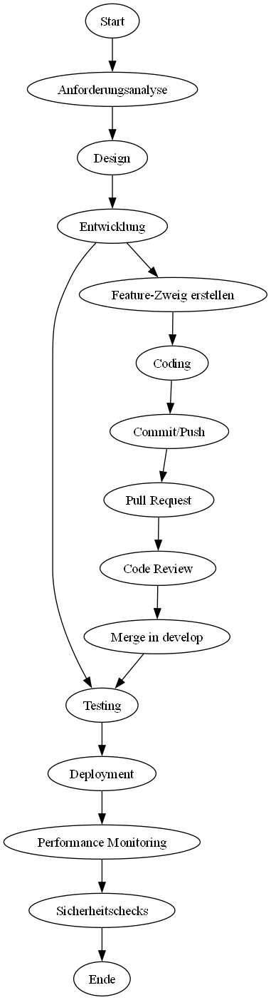
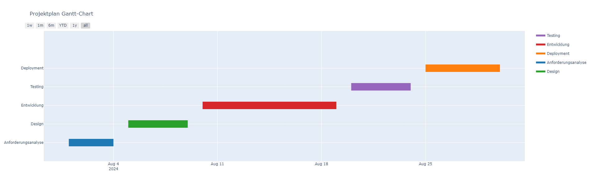
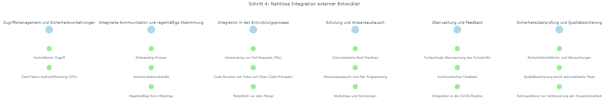

## Projektmanagement und Versionskontrolle

### Schritt 1: Strategische Auswahl der Werkzeuge

- **Versionskontrolle**: 
  - **Git** wird als bewährtes und leistungsstarkes Versionskontrollsystem genutzt, um eine detaillierte Nachverfolgbarkeit aller Änderungen und eine effiziente Zusammenarbeit in verteilten Teams zu gewährleisten.
  - Besondere Aufmerksamkeit gilt einer sauberen Branch-Strategie (z.B. **Git-Flow**) und der Einhaltung klar definierter Commit-Richtlinien nach dem **Single Responsibility Principle (SRP)**.

- **Projektmanagement**:
  - Für die Planung und Nachverfolgung des Projekts wird **Jira** eingesetzt, das sich hervorragend für komplexe, agile Entwicklungsprojekte eignet.
  - Alternativ bietet **Trello** eine visuelle und intuitive Möglichkeit, Aufgaben zu organisieren, insbesondere für kleinere Teams oder weniger komplexe Projekte.
  - Aufgaben werden nach dem **Kanban-Prinzip** organisiert, um eine kontinuierliche und transparente Arbeitsweise sicherzustellen.

- **Kommunikation**:
  - Tools wie **Slack** oder **Microsoft Teams** gewährleisten eine reibungslose Kommunikation, dokumentierte Entscheidungen und eine ständige Synchronisation aller Teammitglieder – intern und extern.
  - Diese Tools ermöglichen es, in Echtzeit zusammenzuarbeiten und sicherzustellen, dass alle Beteiligten stets auf dem gleichen Stand sind.

### Schritt 2: Einrichtung der Entwicklungsumgebung mit Best Practices und Clean Code-Prinzipien

- **Repository-Setup**:
  - Die Einrichtung eines zentralen Git-Repositories auf **GitHub** oder **GitLab** bildet den ersten Schritt.
  - Für das neue Feature wird ein separater Branch erstellt, um eine parallele Entwicklung zu ermöglichen, ohne den Hauptbranch zu destabilisieren.
  - Der Einsatz von **Git-Flow** als Workflow strukturiert und optimiert die Entwicklungsprozesse. Jeder Branch folgt dabei klaren Namenskonventionen, um die Übersichtlichkeit zu wahren.

- **Containerisierung und Konsistenz**:
  - Zur Gewährleistung einer konsistenten Entwicklungsumgebung wird **Docker** verwendet.
  - Dadurch arbeiten alle Entwickler, unabhängig von ihrer individuellen Umgebung, mit den gleichen Abhängigkeiten und Konfigurationen, was die Entwicklungsgeschwindigkeit erhöht und Fehlerquellen minimiert.
  - **Docker Compose** kommt zum Einsatz, um alle Dienste, die das Feature benötigt, einfach und konsistent zu starten.

- **CI/CD-Implementierung**:
  - **Continuous Integration und Continuous Deployment (CI/CD)** wird mittels **Jenkins**, **GitLab CI/CD** oder **CircleCI** integriert, um sicherzustellen, dass jeder Code, der in das Repository integriert wird, automatisch getestet und bei Erfolg sofort bereitgestellt wird.
  - Dies reduziert die Zeit bis zur Markteinführung erheblich und stellt gleichzeitig eine hohe Qualität sicher.
  - Die CI/CD-Pipeline umfasst auch **automatisierte Code-Formatierungsprüfungen** und **Linting**, um die Einhaltung von Coding-Standards sicherzustellen.

### Schritt 3: Effiziente Dokumentation und Pflege der Versionshistorie

Die Pflege und Dokumentation der Versionshistorie ist entscheidend für die Nachvollziehbarkeit von Änderungen, die Zusammenarbeit im Team und die langfristige Wartbarkeit des Projekts. Mehrere Methoden und Tools stellen sicher, dass die Versionshistorie klar, detailliert und nützlich bleibt.

- **Commit-Richtlinien**:
  - **Klar definierte Commit-Richtlinien**: Jeder Commit sollte klein, thematisch fokussiert und durch eine prägnante Nachricht dokumentiert sein.
  - Die Commit-Nachrichten folgen dem **Imperativstil** (z.B., "Fix bug in user authentication module") und enthalten relevante Informationen darüber, was geändert wurde und warum.
  - **Commit-Nachrichten Formatierung**: Eine typische Commit-Nachricht kann aus folgenden Teilen bestehen:
    - **Header**: Eine kurze Zusammenfassung (maximal 50 Zeichen), die prägnant die Änderung beschreibt.
    - **Body** (optional): Eine detailliertere Beschreibung der Änderung, die Hintergrundinformationen oder Erklärungen zur Implementierung enthält. Hier kann auch auf relevante Tickets oder Issues verwiesen werden.
    - **Footer** (optional): Informationen zu weiterführenden Links, Ticket-Referenzen oder Anweisungen, z.B., "Fixes #123".
  - **Atomic Commits**: Commits sollten atomar sein, das heißt, jede Änderung sollte eine logische Einheit darstellen, die unabhängig von anderen Änderungen funktioniert. Dies erleichtert das Revertieren von Commits und die Identifizierung von Fehlerquellen.

- **Verwendung von Tags und Releases**:
  - **Tagging wichtiger Versionen**: Tags in Git kennzeichnen wichtige Meilensteine wie Releases oder stabile Zwischenversionen.
  - Diese Tags sind mit einer Versionsnummer versehen (z.B., `v1.0.0`, `v1.1.0-beta`) und dienen oft als Ausgangspunkt für Deployments oder Rollbacks.
  - **Release-Management**: Für jede freigegebene Version wird ein Release im Repository (z.B. auf GitHub/GitLab) erstellt. Diese Releases enthalten nicht nur den Code-Tag, sondern auch eine umfassende Release-Beschreibung, die alle neuen Features, Bugfixes und Änderungen detailliert auflistet. Dies erleichtert es dem Team und den Stakeholdern, nachzuvollziehen, was sich von einer Version zur nächsten geändert hat.

- **Branching-Strategien zur Versionshistorie-Pflege**:
  - **Branch-Namenskonventionen**: Branches werden nach einem konsistenten Schema benannt, das Rückschlüsse auf ihren Zweck und ihre Herkunft zulässt. Zum Beispiel könnten Feature-Branches `feature/user-authentication`, Bugfix-Branches `bugfix/fix-login-issue` und Release-Branches `release/v1.0.0` genannt werden. Dies erleichtert die Navigation und das Management von Branches, insbesondere in großen Projekten.
  - **Pull Request (PR)-Strategie**: Vor jedem Merge in den Hauptbranch wird ein Pull Request erstellt, der alle Änderungen zusammenfasst und eine Plattform für Diskussionen und Code-Reviews bietet. Jeder PR sollte eine klare Beschreibung des Zwecks und Umfangs der Änderungen enthalten sowie eine Referenz zu den relevanten Tickets oder Aufgaben in den Projektmanagement-Tools wie **Jira**.

- **Detaillierte Änderungsprotokolle (Changelogs)**:
  - **Automatische Changelog-Generierung**: Ein Prozess zur automatischen Generierung von Changelogs wird implementiert, der die Commit-Nachrichten auswertet und daraus eine detaillierte Liste aller Änderungen erstellt. Tools wie **standard-version** oder **release-it** sind hierbei hilfreich.
  - **Manuelle Ergänzungen**: Neben der automatischen Generierung werden bei Bedarf manuelle Ergänzungen vorgenommen, um wichtige Kontextinformationen oder detailliertere Beschreibungen komplexer Änderungen hinzuzufügen.
  - **Formatierung des Changelogs**: Der Changelog wird in Kategorien wie "Added", "Changed", "Deprecated", "Removed", "Fixed", und "Security" strukturiert, um die Änderungen leicht verständlich zu machen. Jede Änderung ist mit einem Link zum entsprechenden Pull Request oder Issue versehen.

- **Dokumentation von Code-Reviews und Entscheidungsprozessen**:
  - **Code-Review-Protokoll**: Jedes Code-Review wird dokumentiert, einschließlich der besprochenen Änderungen, Feedbacks und der finalen Entscheidung. Diese Protokolle werden in einem zentralen Repository (z.B. einem Wiki oder direkt im Pull Request) gespeichert, um späteren Zugriff und Nachvollziehbarkeit zu gewährleisten.
  - **Entscheidungslogbuch**: Wichtige Entscheidungen, die während der Entwicklung getroffen werden, werden in einem Entscheidungslogbuch (Decision Log) festgehalten. Dies umfasst technische Entscheidungen, z.B., warum eine bestimmte Architektur gewählt wurde, und ermöglicht es, die Beweggründe für vergangene Entscheidungen nachzuvollziehen.

- **Automatisierte Versionsverwaltung und Verifizierung**:
  - **CI/CD-Integration für Versionsmanagement**: In der CI/CD-Pipeline wird sichergestellt, dass bei jedem erfolgreichen Build die Versionsnummer automatisch erhöht wird, abhängig von der Art der Änderungen (Patch, Minor, Major). Tools wie **Semantic Release** automatisieren diesen Prozess, um sicherzustellen, dass die Versionierung stets konsistent und regelkonform bleibt.
  - **Verifizierte Merges**: Vor jedem Merge in den Hauptbranch wird sichergestellt, dass alle Commit-Metadaten korrekt sind, und der Code durch automatisierte Tests validiert wurde. Nur verifizierte Merges werden in den Hauptbranch übernommen, um die Qualität und Konsistenz der Versionshistorie zu wahren.

### Schritt 4: Nahtlose Integration externer Entwickler

Die Integration externer Entwickler in den Entwicklungsprozess ist entscheidend für den Erfolg des Projekts. Mehrere Maßnahmen werden ergriffen, um sicherzustellen, dass die Arbeit externer Entwickler reibungslos in die bestehenden Prozesse integriert und kontrolliert wird:

- **Zugriffsmanagement und Sicherheitsvorkehrungen**:
  - **Kontrollierter Zugriff**: Externe Entwickler erhalten nur den notwendigen Zugriff auf das Repository und relevante Systeme, die für ihre Aufgaben erforderlich sind. Dieser Zugriff wird durch Rollen- und Rechte-Management in Plattformen wie **GitHub**, **GitLab** oder **Bitbucket** gesteuert. Sensible Bereiche, wie Produktionsdaten oder kritische Infrastrukturen, bleiben strikt geschützt.
- **Zwei-Faktor-Authentifizierung (2FA)**:
  - Dies schützt das Repository vor unautorisiertem Zugriff und stellt sicher, dass nur berechtigte Personen Änderungen vornehmen können.

- **Integrierte Kommunikation und regelmäßige Abstimmung**:
  - **Onboarding-Prozess**: Externe Entwickler durchlaufen einen strukturierten Onboarding-Prozess, in dem sie mit den Projektanforderungen, den verwendeten Tools und den relevanten Prozessen vertraut gemacht werden. Dieser Prozess umfasst eine Einführung in die **Clean Code-Prinzipien**, die im Projekt angewendet werden, sowie in die spezifischen Anforderungen des Projekts.
  - **Kommunikationskanäle**: Externe Entwickler werden von Anfang an in alle relevanten Kommunikationskanäle (z.B. **Slack**, **Microsoft Teams**) integriert. Hierdurch wird sichergestellt, dass sie in Echtzeit mit dem internen Team kommunizieren können und stets auf dem neuesten Stand sind. Wichtige Informationen, wie Entwicklungsrichtlinien, Coding Standards und Projekt-Updates, werden regelmäßig geteilt.
  - **Regelmäßige Sync-Meetings**: Wöchentliche oder sogar tägliche Sync-Meetings (z.B. Daily Stand-ups) werden organisiert, um den Fortschritt zu überprüfen, Herausforderungen zu identifizieren und kurzfristige Anpassungen zu besprechen. Diese Meetings fördern den Austausch zwischen internen und externen Entwicklern und stellen sicher, dass alle Beteiligten auf dem gleichen Stand sind.

- **Integration in den Entwicklungsprozess**:
  - **Verwendung von Pull Requests (PRs)**: Alle Änderungen, die von externen Entwicklern vorgenommen werden, müssen über Pull Requests (PRs) in den Hauptbranch integriert werden. Jeder PR wird einer gründlichen Überprüfung durch interne Teammitglieder unterzogen, um sicherzustellen, dass er den Qualitätsstandards entspricht und keine unerwünschten Nebeneffekte verursacht. Dies stellt sicher, dass die Arbeit externer Entwickler kontrolliert in den Prozess integriert wird.
  - **Code-Reviews mit Fokus auf Clean Code-Prinzipien**: Bei der Überprüfung der PRs wird besonders darauf geachtet, dass der eingereichte Code den **Clean Code-Prinzipien** folgt, die im Projekt festgelegt sind. Externe Entwickler erhalten spezifisches Feedback, das ihnen hilft, ihren Code weiter zu verbessern und sich besser in die bestehenden Code-Standards einzugliedern.
  - **Testpflicht vor dem Merge**: Jede Änderung, die von externen Entwicklern eingebracht wird, muss vor dem Merge in den Hauptbranch alle automatisierten Tests (z.B. Unit Tests, Integrationstests) erfolgreich bestehen. Dies wird durch die CI/CD-Pipeline sichergestellt, die jede Änderung automatisch testet und nur bei bestandenem Testlauf die Integration zulässt.

- **Schulung und Wissensaustausch**:
  - **Dokumentierte Best Practices**: Externe Entwickler haben Zugriff auf ein zentrales Wiki oder eine Dokumentationsplattform, auf der alle relevanten Informationen zu Coding Standards, Architekturentscheidungen und Best Practices hinterlegt sind. Diese Dokumentation wird regelmäßig aktualisiert und dient als Leitfaden für die Arbeit am Projekt.
  - **Wissensaustausch und Pair Programming**: Um externen Entwicklern das Verständnis für den bestehenden Code zu erleichtern, werden gezielte Pair Programming-Sessions zwischen internen und externen Entwicklern organisiert. Dies fördert den direkten Wissensaustausch und verbessert die Qualität der Zusammenarbeit. Durch Pair Programming werden komplexe Probleme schneller gelöst und der Code bleibt konsistent und wartbar.
  - **Workshops und Schulungen**: Bei Bedarf werden Workshops oder Schulungen zu spezifischen Themen angeboten, wie z.B. den genutzten Technologien, den eingesetzten Frameworks oder spezifischen Clean Code-Prinzipien. Dies stellt sicher, dass externe Entwickler nicht nur wissen, was von ihnen erwartet wird, sondern auch, wie sie es effektiv umsetzen können.

- **Überwachung und Feedback**:
  - **Fortlaufende Überwachung des Fortschritts**: Die Arbeit externer Entwickler wird kontinuierlich überwacht, um sicherzustellen, dass alle Aufgaben nach Plan verlaufen. Dies geschieht durch die Verwendung von Projektmanagement-Tools wie **Jira** oder **Trello**, in denen alle Aufgaben klar definiert und deren Fortschritt nachverfolgt werden kann. Regelmäßige Status-Updates werden eingefordert und überprüft.
  - **Kontinuierliches Feedback**: Externe Entwickler erhalten regelmäßiges Feedback zu ihrer Arbeit, sowohl während des Code-Review-Prozesses als auch in den regelmäßigen Meetings. Dieses Feedback ist konstruktiv und zielgerichtet, mit dem Fokus auf kontinuierliche Verbesserung und Einhaltung der Projektstandards. Feedback-Schleifen werden genutzt, um Probleme frühzeitig zu erkennen und Lösungen zu finden, bevor sie sich auf das Endprodukt auswirken.
  - **Integration in die CI/CD-Pipeline**: Die Arbeit externer Entwickler wird direkt in die CI/CD-Pipeline integriert, um sicherzustellen, dass alle Änderungen nahtlos in den Entwicklungsprozess einfließen. Automatisierte Tests und Builds gewährleisten, dass der Code sofort validiert wird und potenzielle Probleme sofort erkannt werden.

- **Sicherheitsüberprüfung und Qualitätssicherung**:
  - **Sicherheitsrichtlinien und Überprüfungen**: Externe Entwickler müssen sich an die festgelegten Sicherheitsrichtlinien halten. Diese umfassen den sicheren Umgang mit Daten, den Schutz von sensiblen Informationen und die Einhaltung der Datenschutzbestimmungen. Änderungen, die von externen Entwicklern vorgeschlagen werden, durchlaufen eine Sicherheitsüberprüfung, bevor sie in den Hauptbranch integriert werden.
  - **Qualitätssicherung durch automatisierte Tests**: Vor dem Merge in den Hauptbranch wird der Code externen Entwicklern durch umfassende automatisierte Tests validiert. Diese Tests beinhalten Unit-Tests, Integrationstests und End-to-End-Tests, um sicherzustellen, dass die Änderungen den gewünschten Qualitätsstandards entsprechen. Externe Entwickler sind angehalten, ihre eigenen Tests zu schreiben und sicherzustellen, dass alle Tests vor dem Erstellen eines Pull Requests erfolgreich durchgeführt wurden.
  - **Retrospektiven zur Verbesserung der Zusammenarbeit**: Nach Abschluss von Projekten oder wichtigen Meilensteinen werden Retrospektiven durchgeführt, bei denen externe und interne Entwickler gemeinsam reflektieren, was gut gelaufen ist und wo Verbesserungen notwendig sind. Diese Retrospektiven helfen dabei, zukünftige Projekte noch effizienter und reibungsloser zu gestalten.

### Schritt 5: Sicherstellung höchster Code-Qualität

- **Automatisierte Teststrategien**:
  - Eine umfassende Teststrategie wird implementiert, die **Linting**, **Unit Tests**, **Integrationstests** und **End-to-End Tests** umfasst.
  - Diese Tests werden automatisch in der CI/CD-Pipeline ausgeführt, um sicherzustellen, dass der Code robust und fehlerfrei ist. Hierbei wird besonders darauf geachtet, dass die Tests **selbsterklärend** und **modular** aufgebaut sind, sodass sie leicht gewartet werden können.

- **Performance Monitoring**:
  - Nach dem Deployment wird die Performance des neuen Features kontinuierlich mit Tools wie **New Relic** oder **Datadog** überwacht.
  - Dies ermöglicht es, Performance-Probleme frühzeitig zu erkennen und zu beheben.
  - Die Überwachung erfolgt in Echtzeit, und Alerts werden bei Abweichungen ausgelöst, um schnell reagieren zu können.

- **Sicherheitschecks**:
  - Zur Gewährleistung der Sicherheit des Codes werden Sicherheitsüberprüfungen in die CI/CD-Pipeline integriert, wie z.B. **SAST (Static Application Security Testing)** und **DAST (Dynamic Application Security Testing)**.
  - Diese automatisierten Sicherheitschecks minimieren potenzielle Sicherheitsrisiken im Code und stellen sicher, dass der Code den **Sicherheitsstandards** entspricht.

## Visualisierung

- **Flussdiagramm des Softwareentwicklungsprozesses**:
  - 

- **Beispiel für die Repository-Struktur in Git**:
  - Dateipfad: "[Repository-Struktur](./Repository-Struktur)"

- **Zeitplan**:
  - 

- **Live-Zeitplan**:
  - Datei: [Live-Zeitplan öffnen](./Projektmanagement-und-Versionskontrolle-Plan.html)

- **Visualisierung der Nahtlosen Integration externer Entwickler**:
  - 

