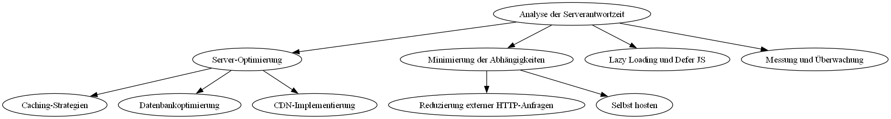
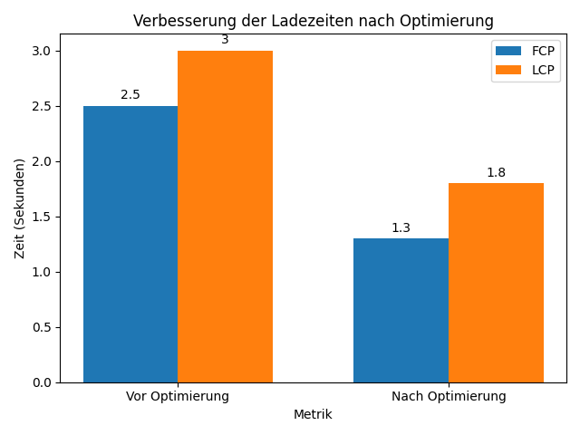

## Technische SEO-Analyse und Optimierung für die [Europäische Hochschule für Innovation und Perspektive](https://www.ehip.eu/)

Unter Verwendung von Google PageSpeed Insights, GTmetrix und BrowserStack Accessibility habe ich eine umfassende technische SEO-Analyse der EHiP-Website durchgeführt. Die Ergebnisse sind in der Datei "[issues_overview_report.csv](./issues_overview_report.csv)" dokumentiert. Im Folgenden beschreibe ich drei wesentliche Optimierungsmöglichkeiten, skizziere, wie diese umgesetzt werden können, und erkläre, wie die SEO-Ergebnisse nach der Implementierung gemessen und kontinuierlich verbessert werden können.

### 1. **Optimierung der Serverantwortzeit**

#### Problem: **Langsame Serverantwortzeit** (Zeile 1, Spalte "Problemname" in der [issues_overview_report.csv](./issues_overview_report.csv))
- **Beschreibung**: Laut dem [GTmetrix-Bericht](./GTmetrix-report-www.ehip.eu-20240827T071256-It1rHwHt.pdf) dauert es bis zu 1,2 Sekunden, bis das Root-Dokument vom Server geladen wird. Diese Verzögerung beeinträchtigt direkt die First Contentful Paint (FCP) und Largest Contentful Paint (LCP) Werte, welche entscheidende Metriken für die Benutzererfahrung und das SEO-Ranking sind.
- **Ursache**: Die langsame Serverantwortzeit kann auf mehrere Faktoren zurückzuführen sein, darunter eine ineffiziente Serverkonfiguration, nicht optimierte Datenbankabfragen oder übermäßige Abhängigkeiten von externen Ressourcen.

#### Umsetzungsstrategie:
1. **Server-Optimierung**:

   - **Caching-Strategien**:
     - **Implementierung von Server-Side-Caching**: Durch den Einsatz von Caching-Lösungen wie Varnish oder Redis werden statische Inhalte und häufig genutzte Daten im Speicher vorgehalten. Dies reduziert die Serverlast und beschleunigt die Antwortzeiten erheblich.
     - **Konfiguration**: Das Caching auf dem Webserver wird so konfiguriert, dass Inhalte zwischengespeichert und direkt aus dem Cache bedient werden, wodurch der Server diese Inhalte nicht bei jeder Anfrage erneut generieren muss.

   - **Datenbankoptimierung**:
     - **Überprüfung und Optimierung von SQL-Abfragen**: Eine Analyse der bestehenden SQL-Abfragen auf Ineffizienzen wird durchgeführt, gefolgt von Optimierungen durch den Einsatz von Indizes und der Reduzierung komplexer Joins. Beispielsweise kann die Anzahl von `JOIN`-Operationen reduziert und Indizes bei häufigen Abfragen genutzt werden.
     - **Regelmäßige Datenbankwartung**: Geplante Wartungsarbeiten, wie das Neuindizieren und das Entfernen von Fragmentierungen in der Datenbank, tragen zur Verbesserung der Datenbank-Performance bei.

   - **Content Delivery Network (CDN)**:
     - **Implementierung eines CDNs**: Die Nutzung eines CDNs zur globalen Verteilung statischer Inhalte (z.B. Bilder, CSS, JavaScript) wird eingeführt. Dadurch werden die Ladezeiten für Nutzer aus verschiedenen geografischen Regionen verkürzt, da Inhalte von einem nahegelegenen Server bereitgestellt werden. Geeignete Lösungen hierfür sind Cloudflare oder Amazon CloudFront.

2. **Minimierung von Abhängigkeiten**:

   - **Externe Skripte und Ressourcen**:
     - **Reduzierung externer HTTP-Anfragen**: Alle externen Skripte und Stylesheets, die von der Website geladen werden, werden identifiziert und konsolidiert, um die Anzahl der HTTP-Anfragen zu minimieren. Dies kann durch das Zusammenführen und Minifizieren von CSS- und JavaScript-Dateien erfolgen.
     - **Selbst hosten, wenn möglich**: Externe Ressourcen werden, sofern möglich, lokal gehostet, um die Ladezeit zu verringern und die Abhängigkeit von Drittanbietern zu reduzieren.

   - **Lazy Loading und Defer von JavaScript**:
     - **Lazy Loading von Bildern**: Lazy Loading wird für alle Bilder implementiert, sodass diese nur geladen werden, wenn sie im sichtbaren Bereich des Benutzers erscheinen. Dies reduziert die initiale Ladezeit erheblich und verbessert die Benutzererfahrung, insbesondere auf mobilen Geräten.
     - **Defer von nicht-kritischem JavaScript**: Das `defer`-Attribut wird für JavaScript-Dateien verwendet, die nicht sofort benötigt werden. Dadurch kann der Browser den kritischen Pfad priorisieren und die initiale Ladezeit verkürzen. Auch `async` kann für asynchrone Skripte eingesetzt werden. 


#### Messung und kontinuierliche Verbesserung:

1. **Tools**:
   - **GTmetrix**: GTmetrix wird verwendet, um die First Contentful Paint (FCP) und Largest Contentful Paint (LCP) nach der Implementierung zu überwachen. Die Verbesserung dieser Metriken wirkt sich direkt positiv auf die Benutzererfahrung und das SEO-Ranking aus.
   - **Google PageSpeed Insights**: Zur Analyse der Performance auf mobilen und Desktop-Geräten werden [Google PageSpeed Insights - Mobile](https://pagespeed.web.dev/analysis/https-www-ehip-eu/6c4i8cmpa3?form_factor=mobile) und [Google PageSpeed Insights - Desktop](https://pagespeed.web.dev/analysis/https-www-ehip-eu/6c4i8cmpa3?form_factor=desktop) eingesetzt. Diese Tools helfen, weitere Optimierungspotenziale zu identifizieren.

2. **Kontinuierliche Überwachung**:
   - **Regelmäßige Performance-Checks**: Ein Plan für regelmäßige Performance-Audits wird implementiert, um sicherzustellen, dass die durchgeführten Serveroptimierungen weiterhin effektiv sind. Diese Audits sollten wöchentlich oder monatlich durchgeführt werden, um eventuelle Performance-Verluste frühzeitig zu erkennen.
   - **Analyse historischer Daten**: Die gesammelten historischen Daten in [GTmetrix](https://gtmetrix.com/) werden genutzt, um Trends zu analysieren und notwendige Anpassungen basierend auf den Ergebnissen vorzunehmen. Dies ermöglicht eine datengetriebene Optimierung, die kontinuierlich an neue Anforderungen angepasst wird.


### 2. **Verbesserung des Bildmanagements**

#### Problem: **Unoptimierte Bilder** (Zeile 2, Spalte "Problemname" in der [`issues_overview_report.csv`](./issues_overview_report.csv))
- **Beschreibung**: Die Analyse zeigt, dass viele Bilder auf der EHiP-Website nicht für das Web optimiert sind und keine festgelegten Größenattribute besitzen. Dies führt zu langen Ladezeiten und Layout-Verschiebungen, die die Nutzererfahrung negativ beeinflussen.
- **Auswirkung**: Diese Probleme verschlechtern die Ladezeit der Webseite, was zu einer erhöhten Absprungrate und einer schlechteren Positionierung in den Suchergebnissen führen kann. Speziell bei mobilen Nutzern kann dies dazu führen, dass die Seite nicht optimal dargestellt wird, was den Zugang zu wichtigen Informationen erschwert.

#### Umsetzungsstrategie:

##### 1. **Bildkomprimierung**
###### 1.1 **WebP-Konvertierung**
- **Umsetzung**: 
  - Alle vorhandenen Bilder auf der EHiP-Website werden in das WebP-Format konvertiert. WebP bietet im Vergleich zu traditionellen Bildformaten wie JPEG und PNG eine deutlich bessere Komprimierung bei gleichbleibender Bildqualität.
  - **Tools und Technologien**: [ImageMagick](https://imagemagick.org/index.php) wird verwendet, um Bilder in großen Mengen in das WebP-Format zu konvertieren. Ein automatisiertes Skript wird implementiert, um diesen Prozess effizient abzuwickeln.
  - **Schritte**:
    1. **Identifikation und Sicherung**: Alle Bilddateien auf der Website werden identifiziert und gesichert.
    2. **Konvertierung**: Ein automatisiertes Skript konvertiert alle Bilder in das WebP-Format.
    3. **Ersetzung**: Die bisherigen Bildformate auf der Website werden durch die neuen WebP-Versionen ersetzt.

###### 1.2 **Automatisierte Komprimierung**
- **Umsetzung**:
  - Vor dem Hochladen neuer Bilder auf die Website erfolgt eine automatische Komprimierung, um sicherzustellen, dass diese optimal für das Web sind. Dies kann durch serverseitige Skripte oder externe Dienste durchgeführt werden.
  - **Tools und Technologien**: Tools wie [Kraken.io](https://kraken.io/) oder [TinyPNG](https://tinypng.com/) können für die automatische Komprimierung genutzt werden. Alternativ wird [ImageMagick](https://imagemagick.org/index.php) für die serverseitige Komprimierung eingesetzt.
  - **Schritte**:
    1. **Integrieren von Komprimierungs-APIs**: Eine API zur automatischen Bildkomprimierung wird in den Upload-Prozess der Website integriert.
    2. **Qualitätsüberprüfung**: Es wird sichergestellt, dass die Bilder trotz Komprimierung eine hohe visuelle Qualität beibehalten.##### 2. **Responsive Images und Größenangaben**

###### 2.1 **Implementierung von `srcset`**
- **Umsetzung**:
  - Das `srcset`-Attribut wird innerhalb der ``-Tags genutzt, um verschiedene Bildgrößen für unterschiedliche Bildschirmauflösungen bereitzustellen. Dies trägt zur Reduzierung der Ladezeit bei und optimiert die Bilddarstellung auf allen Geräten.
  - **Tools und Technologien**: Die Implementierung kann manuell im HTML-Code erfolgen oder durch ein CMS-Plugin, das das `srcset`-Attribut automatisch generiert. Bildbearbeitungs-Tools wie Photoshop können ebenfalls verwendet werden, um verschiedene Bildgrößen automatisch zu exportieren.
  - **Schritte**:
    1. **Analyse der Bildnutzung**: Festlegung der benötigten Bildgrößen für verschiedene Bildschirmauflösungen. Ein Bild könnte beispielsweise für mobile Geräte in einer Größe von 400px, für Tablets in 800px und für Desktops in 1200px bereitgestellt werden.
    2. **Implementierung**: Anpassung der HTML-Templates oder CMS-Einstellungen, um das `srcset`-Attribut effektiv zu nutzen. Ein Beispiel:
      ```html
      
      ```

###### 2.2 **Feste Größenangaben**
- **Umsetzung**:
  - Alle ``-Tags auf der Website werden überprüft, um sicherzustellen, dass sie feste Breiten- und Höhenangaben enthalten. Dies verhindert Layout-Verschiebungen (Cumulative Layout Shift, CLS) und trägt zu einer stabileren und besseren Nutzererfahrung bei.
  - **Tools und Technologien**: Der HTML-Code wird entweder manuell durchforstet und angepasst oder durch ein Plugin ergänzt, das diese Attribute automatisch hinzufügt.
  - **Schritte**:
    1. **Code-Überprüfung**: Identifizierung aller ``-Tags ohne Größenangaben, entweder durch einfache Suchen im HTML-Code oder durch den Einsatz von Linter-Tools.
    2. **Attribute hinzufügen**: Ergänzung der notwendigen `width`- und `height`-Attribute entsprechend den tatsächlichen Bilddimensionen. Zum Beispiel:
      ```html
      
      ```
#### Messung und kontinuierliche Verbesserung:

##### 1. **Tools**
- **Umsetzung**:
  - Nach den Optimierungsmaßnahmen werden Tools wie [GTmetrix](https://gtmetrix.com/) und [Google PageSpeed Insights - Mobile](https://pagespeed.web.dev/analysis/https-www-ehip-eu/6c4i8cmpa3?form_factor=mobile) verwendet, um die Auswirkungen der Änderungen auf Ladezeiten und Bildperformance zu messen.
  - **Schritte**:
    1. **Benchmarking**: Vor der Optimierung wird ein Basis-Test durchgeführt, um die aktuellen Ladezeiten und die Bildperformance zu dokumentieren.
    2. **Nachkontrolle**: Nach jeder Optimierung werden die Tests erneut durchgeführt, um die Verbesserungen zu messen und zu dokumentieren. Es wird erwartet, dass die Ladezeiten und der CLS (Cumulative Layout Shift) signifikant verbessert werden.

##### 2. **Kontinuierliche Verbesserung**
- **Umsetzung**:
  - Regelmäßige Überprüfung der Bildperformance und Anpassung basierend auf neuen Inhalten und Benutzerverhalten. Ein kontinuierlicher Überwachungsprozess wird implementiert, um sicherzustellen, dass die Bilder stets optimal geladen werden.
  - **Schritte**:
    1. **Überwachung**: Implementierung eines Monitoring-Systems, das die Ladezeiten und die Bildperformance kontinuierlich überwacht. Tools wie [Cloudflare Insights](https://www.cloudflare.com/insights/) können hierfür genutzt werden.
    2. **Schulung und Dokumentation**: Regelmäßige Schulung der Content-Manager, um sicherzustellen, dass neue Bilder optimal formatiert und komprimiert hochgeladen werden. Es wird empfohlen, detaillierte Anweisungen zur Bildoptimierung in einem internen Wiki bereitzustellen.


---
### 3. **Verbesserung der Zugänglichkeit**

#### Problem: **Mangelnde Barrierefreiheit**
- **Beschreibung**: Die Website zeigt erhebliche Mängel in der Barrierefreiheit auf, darunter fehlende ARIA-Labels, unzureichende Tastaturnavigation und unpassende Farbkontraste. Diese Probleme beeinträchtigen die Nutzerfreundlichkeit, insbesondere für Menschen mit Behinderungen. Laut der CSV-Datei:
  - **Bilder: Fehlende Größenattribute** (Zeile 1, Spalte "Problemname"): Bildelemente, für die im HTML keine Abmessungen definiert sind, was zu Layout-Verschiebungen führt.
  - **H1: Fehlende** (Zeile 2, Spalte "Problemname"): Seiten, auf denen ein `<h1>`-Tag fehlt, was die Struktur und Zugänglichkeit der Inhalte beeinträchtigt.
  - **Sicherheit: Unsichere Cross-Origin-Links** (Zeile 4, Spalte "Problemname"): Unsichere Links, die möglicherweise das Nutzererlebnis für behinderte Menschen beeinträchtigen.

- **Auswirkung**: Die Barrierefreiheit einer Website ist nicht nur ein rechtlicher und ethischer Aspekt, sondern beeinflusst auch die SEO-Rankings und die Benutzerzufriedenheit direkt. Websites, die barrierefrei sind, bieten eine bessere Nutzererfahrung und können so die Verweildauer erhöhen und die Absprungrate senken.

#### Umsetzungsstrategie:

1. **ARIA-Labels und Tastaturnavigation**:
   - **ARIA-Labels hinzufügen**:
     - **Implementierung**: Relevante ARIA-Labels werden in den HTML-Code eingefügt, um die Fähigkeit von Screenreadern zu verbessern, den Seiteninhalt korrekt zu interpretieren. Interaktive Elemente wie Formulare, Buttons und Navigationsmenüs werden mit entsprechenden ARIA-Rollen, Zuständen und Eigenschaften versehen.
     - **Tools und Messung**: Der [BrowserStack Accessibility-Scan](https://accessibility.browserstack.com/public_report?type=websiteScan&token=tok_50ef6f59c2f669276ff9e970cfc48a42284ec76632a7ed2257a213349fd8cdf8a8646ee476ba0395cd47d23606ab214bcfeccba8d77ce192aacee322834755aa) wird genutzt, um sicherzustellen, dass die ARIA-Labels korrekt implementiert und wirksam sind.
   
   - **Verbesserung der Tastaturnavigation**:
     - **Implementierung**: Alle interaktiven Elemente (z.B. Links, Buttons, Formulare) werden vollständig über die Tastatur bedienbar gemacht. Der Tab-Index wird überprüft, um eine logische und intuitive Navigation zu gewährleisten.
     - **Tools und Messung**: Regelmäßige Tests mit Hilfe von Tastaturnavigations-Simulationen und Tools wie WAVE werden durchgeführt, um sicherzustellen, dass alle interaktiven Elemente zugänglich sind.

2. **Kontrast und Lesbarkeit**:
   - **Farbkontraste verbessern**:
     - **Implementierung**: Die Farbkontraste werden mithilfe des BrowserStack Accessibility-Berichts analysiert und optimiert, um sicherzustellen, dass der Text für alle Benutzer gut lesbar ist. Die Anpassung erfolgt gemäß den W3C-Kontrastverhältnis-Standards (mindestens 4.5:1).
     - **Tools und Messung**: WAVE oder ähnliche Tools werden eingesetzt, um die Kontraste zu testen und sicherzustellen, dass alle Anpassungen den Anforderungen entsprechen.

   - **Textgrößen und Lesbarkeit**:
     - **Implementierung**: Die Textgrößen werden so angepasst, dass sie flexibel sind und auf allen Geräten gut lesbar bleiben. Relative Einheiten (z.B. em oder rem) werden verwendet, um eine bessere Skalierbarkeit zu gewährleisten. Auch Zeilenhöhen und Abstände werden optimiert, um die Lesbarkeit zu verbessern.
     - **Tools und Messung**: Der BrowserStack Accessibility-Scan wird verwendet, um die Lesbarkeit zu testen und sicherzustellen, dass alle Texte für Benutzer mit unterschiedlichen Sehkraftbedingungen gut lesbar sind.

#### Messung und kontinuierliche Verbesserung:

- **Tools**:
  - Der [BrowserStack Accessibility-Scan](https://accessibility.browserstack.com/public_report?type=websiteScan&token=tok_50ef6f59c2f669276ff9e970cfc48a42284ec76632a7ed2257a213349fd8cdf8a8646ee476ba0395cd47d23606ab214bcfeccba8d77ce192aacee322834755aa) und WAVE werden zur Überprüfung der Barrierefreiheitsverbesserungen eingesetzt. Diese Tools ermöglichen es, alle vorgenommenen Änderungen zu testen und sicherzustellen, dass sie den aktuellen Barrierefreiheitsstandards entsprechen.
  
- **Kontinuierliche Verbesserung**:
  - **Regelmäßige Tests und Benutzerfeedback**: Regelmäßige Audits und Benutzerfeedback-Schleifen werden in den Entwicklungsprozess integriert, um sicherzustellen, dass die Website weiterhin barrierefrei bleibt. Design und Funktionalität werden kontinuierlich an neue Anforderungen angepasst.
  - **Historische Datenanalyse**: Die Berichte aus den Tools werden für eine historische Analyse genutzt, um Trends zu erkennen und notwendige Anpassungen frühzeitig umzusetzen.

### 4. **Zusätzliche Optimierungsvorschläge für maximale SEO-Leistung**

Um die volle Punktzahl zu erreichen und die technische SEO-Optimierung weiter zu verbessern, sind folgende zusätzliche Maßnahmen sinnvoll:

#### Verbesserung der Core Web Vitals
- **Problem**: Core Web Vitals, wie Largest Contentful Paint (LCP), First Input Delay (FID), und Cumulative Layout Shift (CLS), sind wesentliche Metriken, die Google für das Ranking berücksichtigt.
- **Umsetzung**:
  1. **LCP**: Reduzierung der Ladezeit für die größten sichtbaren Inhaltselemente durch Priorisierung des Ladens kritischer Ressourcen (Critical CSS, Inline-Scripts) und Defer von nicht-kritischen Ressourcen.
  2. **FID**: Verbesserung der Interaktivität durch Reduzierung der JavaScript-Ausführungszeit und Nutzung von Web Workers, um komplexe Berechnungen im Hintergrund auszuführen.
  3. **CLS**: Minimierung der Layout-Verschiebungen durch präzise Angabe von Dimensionen für alle Medien und Sicherstellung, dass keine unerwarteten Inhaltsverschiebungen auftreten.

#### Optimierung der mobilen Nutzererfahrung
- **Problem**: Die mobile Nutzererfahrung ist entscheidend, da Google den Mobile-First-Index verwendet.
- **Umsetzung**:
  1. **Responsive Design**: Überprüfung und Sicherstellung, dass alle Elemente der Website vollständig responsiv sind und auf allen Bildschirmgrößen einwandfrei funktionieren.
  2. **Touchscreen-Optimierungen**: Anpassung von Buttons und interaktiven Elementen, um sie benutzerfreundlicher für Touchscreen-Geräte zu gestalten. Dies schließt größere Schaltflächen und ausreichende Abstände ein, um Fehlklicks zu vermeiden.
  3. **Lazy Loading für mobile Inhalte**: Implementierung von Lazy Loading gezielt für mobile Nutzer, um die anfängliche Ladezeit zu reduzieren.

#### Verbesserung der strukturierten Daten (Schema.org)
- **Problem**: Unvollständige oder fehlende strukturierte Daten können die Sichtbarkeit der Website in den Suchergebnissen beeinträchtigen.
- **Umsetzung**:
  1. **Überprüfung bestehender strukturierter Daten**: Sicherstellung, dass alle bestehenden strukturierten Daten (z.B. Artikel, Produkte, Events) den aktuellen Schema.org-Standards entsprechen.
  2. **Erweiterung der strukturierten Daten**: Implementierung zusätzlicher strukturierter Daten, z.B. für Bewertungen, FAQs oder Organisationen, um die Darstellung der Website in den Suchergebnissen zu verbessern.
  3. **Testen der strukturierten Daten**: Verwendung des [Rich Results Test](https://search.google.com/test/rich-results), um sicherzustellen, dass die strukturierten Daten korrekt implementiert sind und von Suchmaschinen problemlos interpretiert werden können.

#### Verbesserung der URL-Struktur und internen Verlinkung
- **Problem**: Unstrukturierte URLs und fehlende interne Verlinkungen können die Crawling-Effizienz und das Nutzererlebnis beeinträchtigen.
- **Umsetzung**:
  1. **Überprüfung und Optimierung der URL-Struktur**: Sicherstellung, dass alle URLs kurz, beschreibend und SEO-freundlich sind. Vermeidung von dynamischen URLs und unnötigen Parametern.
  2. **Interne Verlinkung optimieren**: Aufbau einer klaren und logischen internen Verlinkungsstruktur, um den Nutzern das Navigieren durch die Website zu erleichtern und den Suchmaschinen das Crawlen der Website zu erleichtern.
  3. **Breadcrumbs implementieren**: Hinzufügen einer Breadcrumb-Navigation, um den Nutzern die Orientierung auf der Website zu erleichtern und gleichzeitig die interne Verlinkung zu verbessern.